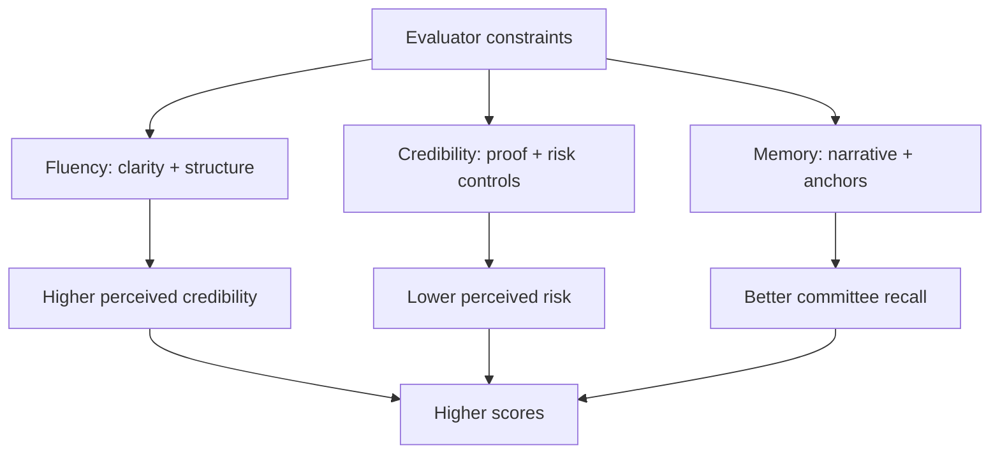

> This article is an expanded, research-hardened version of my draft paper "Using Psychology to Enhance Proposal Persuasion." fileciteturn0file0

## TL;DR

- Proposal evaluations are human decisions wearing a spreadsheet costume. Your job is to make it easy to score you, hard to doubt you, and simple to repeat your story in a room full of skeptics.
- The highest confidence levers are not magic. They are: **processing fluency** (clarity and structure), **anchoring** (benchmarks and baselines), **narrative** (memorable cause and effect), and **risk framing** (credible mitigation).
- "NLP" as a branded theory is weakly supported overall; however, **some techniques marketed as NLP overlap with mainstream evidence** (e.g., framing/reappraisal, synchrony, anchoring). A few "signature" NLP claims (eye-accessing cues, representational systems/predicate matching as a reliable lever) are not supported.

---

## The proposal evaluator's brain: what you're really optimizing

A proposal is not read like a novel. It's read like a **decision dossier**,often under time pressure, with competing submissions, with a rubric, and with committee dynamics.

That means persuasion is less about "clever tricks" and more about:

1. **Ease**: make it effortless to find and believe the right things.
2. **Trust**: signal competence, integrity, and low risk.
3. **Memory**: make key advantages easy to recall and defend in discussions.

### Processing fluency is the hidden multiplier

When information is easier to process, people often judge it as more credible, safer, and more agreeable,sometimes without awareness. Narrative formats frequently outperform non-narratives partly because stories tend to be processed more fluently. citeturn0search1

**What this means in a proposal:**  
- short sentences and concrete claims  
- strong headings and "scannable" structure  
- predictable section patterns ("Requirement → Approach → Proof → Risk controls")  
- consistent terminology (especially for government RFPs)

---

## Evidence-backed levers you can use in proposals (high confidence)

### 1) Anchoring: the first benchmark shapes later judgments

Anchoring is one of the most robust judgment effects across domains. In legal decision-making, a meta-analysis found meaningful anchoring effects, illustrating how salient numeric references can bias evaluations toward a starting point. citeturn1search0

**Commercial application**
- Anchor your value: "Current baseline cost-to-serve is \$X; we reduce by Y% via [levers]."
- Use *credible* anchors: industry benchmarks, peer case studies, audited internal metrics.

**Government application**
- Use *auditable baselines*: IGCE context (if provided), historical contract performance, published labor categories/rates where allowed.
- Avoid "cute" anchors that look like manipulation; make every baseline traceable.

---

### 2) Narrative: make causality memorable

A preregistered experiment found narratives can be more persuasive partly because they increase processing fluency. citeturn0search1

**Commercial application**
- Use a "before → after" story tied to measurable outcomes (time saved, revenue protected, risk reduced).
- Include 1-2 "Day in the Life" vignettes where the solution reduces friction.

**Government application**
- Use mini-narratives that map to **requirements, performance outcomes, and risk controls**:
  - "Here's the workflow for requirement X"
  - "Here's how we verify acceptance"
  - "Here's how we de-risk transition"

Narrative in government proposals isn't "marketing fluff." It's a *traceable* explanation of *how* requirements become outcomes.

---

### 3) Synchrony and rapport: real, but not magical

Synchrony (moving/acting in time together) has been meta-analyzed and is associated with prosocial outcomes; effects are real but context-dependent. citeturn1search1turn1search3

But mimicry in particular can be fragile: a VR study found limited, inconsistent increases in rapport/trust, concluding effects may be "subtle or fragile." citeturn0search0

**Proposal translation**
- In writing, "rapport" becomes **terminology alignment** and **tone alignment**: mirror the customer's problem framing and success criteria.
- In orals, use alignment as *authentic communication hygiene* (pace, clarity, respectful language), not as a covert tactic.

---

## A proposal persuasion playbook you can use tomorrow

### The "3-layer persuasion stack"

1. **Compliance layer** (what you must prove)
   - Map every requirement to a specific response, evidence, and verification step.

2. **Credibility layer** (why you should be trusted)
   - Third-party validation, past performance, quantified results, implementation plans, risk controls.

3. **Preference layer** (why you should be preferred)
   - Differentiators, "win themes," memorable outcomes, and clear tradeoffs.

> If you only build layer 1, you're a compliant vendor.  
> If you build layers 1 + 2, you're a safe vendor.  
> If you build 1 + 2 + 3, you're a *chosen* vendor.

---

## Commercial vs. Government: persuasion constraints change the game

### Commercial solicitations (B2B)

Commercial evaluators often have wider discretion and are heavily influenced by:
- ROI plausibility
- speed-to-value
- executive confidence
- switching risk and operational burden

**What to emphasize**
- the "economic story" (baseline → reduction → payback)
- a believable adoption plan
- social proof (logos, references, outcomes)
- procurement ease (terms, onboarding, support)

### Government solicitations (FAR-based)

In public sector, persuasion is shaped by:
- compliance scoring and traceability
- auditability (can this stand up later?)
- risk aversion (implementation failure is punished)
- committee dynamics (multiple evaluators, consensus)

**What to emphasize**
- requirement traceability (matrix, cross-references)
- risk controls and verification
- management approach, staffing stability, transition plan
- measurable performance outcomes tied to the evaluation factors

---

## NLP, what it gets right, what it gets wrong

My original draft referenced "NLP-inspired" tactics. fileciteturn0file0  
The research reality is nuanced:

### What the evidence says, in plain English

- **NLP as a branded system** is not a coherent, consistently validated scientific theory. Critical reviews conclude unique NLP practices are poorly supported. citeturn2search0  
- Some "signature" NLP claims repeatedly fail tests (e.g., **eye-accessing cues** for deception). citeturn2search3  
- Large-scale reviews of the NLP research database found non-supportive results outweigh supportive ones among higher-quality studies. citeturn2search4  
- U.S. government-related reviews have cataloged NLP among "New Age" techniques and reported little or no scientific evidence for effectiveness in interpersonal influence (this is documentation of *evaluation/interest*, not proof of efficacy). citeturn3search0

### So why do people (including me) experience it as "real"?

Because many NLP trainings bundle together:
- legitimate influence mechanisms (framing, attention, clarity, goal alignment)
- general interpersonal skills (listening, empathy, pacing, structure)
- *plus* weak or untestable theory claims

When someone learns "NLP," the parts that work often work because they overlap with mainstream psychology,not because the unique NLP models are true.

### "NLP" techniques, recast as evidence-safe constructs

| Marketed as NLP | Evidence-safe translation | Should you use it in proposals? |
|---|---|---|
| "Mirroring language" | Terminology alignment, shared mental models | Yes (especially in government) |
| "Presuppositions (‘when we win…')" | Future-oriented framing (without deception) | Yes, sparingly; avoid awkwardness |
| "Reframing" | Cognitive reappraisal + gain/loss framing + risk framing | Yes, but always substantiate |
| "Anchoring" | Benchmarking and baselining | Yes, with traceable sources |
| "Eye-accessing cues" | (No valid replacement) | No |

---

## Ethics, especially for government work

Persuasion is not deception. The win is building preference for a solution that actually fits, and then delivering.

**Avoid:**
- hidden "subliminal" messages (low evidence, high downside)
- exaggerated claims and non-auditable metrics
- pseudo-diagnostics (e.g., "they're visual learners so we'll write like this")

**Prefer:**
- transparency: assumptions, methods, sources
- verifiability: how outcomes are measured
- respect: don't treat evaluators as targets; treat them as partners solving a real problem

---

## Insert-ready templates

### Executive Summary skeleton (commercial)

1. **Outcome hook** (1-2 sentences): baseline + delta  
2. **Why now**: pain, urgency, and cost of inaction  
3. **Solution in one paragraph**: how it works in practice  
4. **Proof**: 2-3 quantified outcomes + reference context  
5. **Risk controls**: adoption plan, support model, security posture  
6. **Call-to-action**: next steps, timeline, decision support

### Executive Summary skeleton (government)

1. **Mission alignment**: match the agency objective without flattery overload  
2. **Compliance claim**: "We meet/exceed requirements X/Y/Z…"  
3. **Approach map**: how you execute (phases + deliverables)  
4. **Risk controls**: transition, staffing, QA, security, continuity  
5. **Proof**: past performance mapped to similar scope and constraints  
6. **Traceable benefits**: measurable, tied to evaluation factors

---

## Illustrations you can embed in MDX

### Option A (best): Mermaid diagrams in MDX

If your MDX pipeline supports Mermaid, you can embed diagrams like this:



**How to enable Mermaid (Next.js + MDX)**
- Add a remark/rehype plugin that converts Mermaid code blocks to SVG at build time *or* render client-side with a `<Mermaid />` component.
- If you're using `next-mdx-remote`, a common pattern is to render Mermaid on the client via `mermaid` + `useEffect`, or use a preprocessor in your content pipeline.

### Option B: Static images in `/public`

Place images in:

```
/public/images/proposals/anchors.png
```

Then reference them in MDX:

```mdx

```

Or, if you prefer Next Image:

```mdx
import Image from "next/image";

<Image
  src="/images/proposals/anchors.png"
  alt="Anchoring diagram"
  width={1200}
  height={675}
/>
```

### Option C: SVGs as first-class MDX components

If you generate an SVG (recommended for diagrams), store it and import it:

```mdx
import AnchoringSvg from "./Anchoring.svg";

<AnchoringSvg aria-label="Anchoring diagram" role="img" />
```

---

## References (selected)

- Bullock, O. M., Shulman, H. C., & Huskey, R. (2021). *Narratives are persuasive because they are easier to understand: Examining processing fluency as a mechanism of narrative persuasion.* Frontiers in Communication. citeturn0search1  
- Bystranowski, P., Janik, B., Próchnicki, M., & Skórska, P. (2021). *Anchoring effect in legal decision-making: A meta-analysis.* Law and Human Behavior. citeturn1search0  
- Rennung, M., & Göritz, A. S. (2016). *Prosocial consequences of interpersonal synchrony: A meta-analysis.* Zeitschrift für Psychologie. citeturn1search3  
- Mogan, R., Fischer, R., & Bulbulia, J. A. (2017). *To be in synchrony or not? A meta-analysis of synchrony's effects on behavior, perception, cognition and affect.* Journal of Experimental Social Psychology. citeturn1search1  
- Hale, J., & Hamilton, A. F. de C. (2016). *Testing the relationship between mimicry, trust and rapport in virtual reality conversations.* Scientific Reports. citeturn0search0  
- Passmore, J., & Rowson, T. (2019). *Neuro-Linguistic-programming: A critical review of NLP research and the application of NLP in coaching.* International Coaching Psychology Review. citeturn2search0  
- Wiseman, R., Watt, C., ten Brinke, L., Porter, S., Couper, S.-L., & Rankin, C. (2012). *The eyes don't have it: Lie detection and Neuro-Linguistic Programming.* PLoS ONE. citeturn2search3  
- Witkowski, T. (2010). *Thirty-Five Years of Research on Neuro-Linguistic Programming.* Polish Psychological Bulletin. citeturn2search4  
- CIA FOIA (CREST/STARGATE). (1990). *Enhancing Human Performance: An Evaluation of "New Age" Techniques Considered by the U.S. Army.* citeturn3search0  

